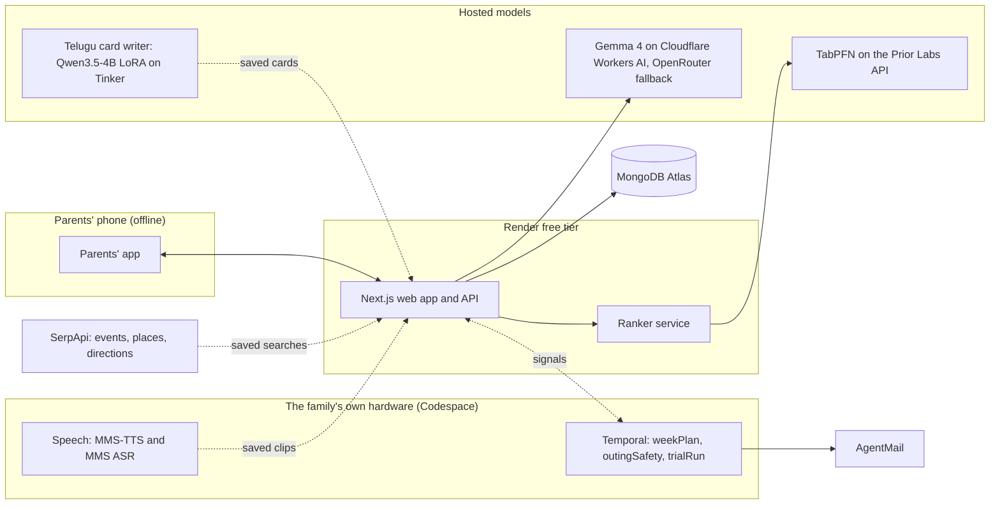

# Roundtrip

Weekdays out, safely home.

My parents flew to the US for our graduation, and once the ceremony was over we went straight back to work, so on weekdays they stayed home. Roundtrip plans a few outings each week for parents visiting their grown child abroad, to real places with real people who speak their language, on trips they can manage on their own and come home from safely.

- **Live demo:** https://roundtrip-web.onrender.com (free Render instance: the first visit after a quiet spell takes about half a minute to wake)
- **The tuned Telugu card writer:** https://huggingface.co/roundtrip-family/roundtrip-card-writer-te-qwen3.5-4b-lora

The demo households are fictional. Sarala and Venkat, a Telugu-speaking couple from Guntur staying in Fremont, California, are a persona modeled on visits like my parents'; Kamala and Raghu in Munich show it works in any country. Their profiles, outings, ratings and diary entries are synthetic. Places, events and transit routes come from live searches.

## The core rule

Route to humans. Every suggestion is a real place or real people, and the assistant never offers itself as company. `evals/route-to-humans.test.ts` enforces it.

## What's inside

- **Parents' app** (`/parents`): installable and offline. The day's ticket with a stub to tear, directions that say when to press stop, a card to show the driver, phrases to practise with Telugu-script pronunciation, "I'm lost", "How was it?", a private diary and a memory book. Every card and phrase is read aloud by an open voice and cached for outings.
- **Dashboard** (`/plan`): the adult child's week board with ranked suggestions, reason chips, fallback-ladder levels, route maps, approve and swap, their week, what they shared, people and places, privacy, safety and languages, plus "Plan the coming week", live.
- **Landing** (`/`). The living style guide (`/design`) runs only with `pnpm dev`, not on the live site.

## How it works



- **Planner:** a Mastra agent on Gemma 4 chooses and explains the week, from places found by SerpApi and a five-rung fallback ladder (same language, shared culture, language barely matters, newcomer and older-adult programs, a regular routine).
- **Ranker:** TabPFN predicts, per parent, whether they'd go and how much they'd enjoy it, from what they rated before. It puts 71% of liked outings in its top 3, against 36% for travel time alone.
- **Cards:** a LoRA on Qwen3.5-4B, trained once on Tinker for $0.22, passes every code check on 98% of held-out cards (Gemma 85%); every card also passes a Gemma review before a parent sees it.
- **Voice:** Meta MMS speaks Telugu, English and German on the family's own hardware; the clips are saved so the hosted demo plays them.
- **Safety:** Temporal timers survive a worker crash: killed 26 s before the alert was due, the restarted worker sent it 160 ms late.
- **Privacy:** only anonymized or synthetic data reaches a hosted service, every outbound call is registered and checked in CI (`docs/privacy-table.md`), and diary entries are encrypted per parent.

Numbers and the commands behind them: [docs/numbers.md](docs/numbers.md). Models and licenses: [docs/models.md](docs/models.md).

## Set up in a Codespace

1. Open the repo in a GitHub Codespace (Code, Codespaces, New codespace). The dev container installs Node, pnpm, Python with uv and the Temporal CLI.
2. Add keys as Codespaces secrets, or in a local `.env`. `pnpm check-env` lists every name and says which are set, never their values. Without keys, everything replays saved answers. Optional: `DEMO_ALERT_EMAIL` and `AGENTMAIL_API_KEY` for email to the adult child (without them nothing is sent and everything else works), `AGENTMAIL_WEBHOOK_SECRET` for email replies, `TEMPORAL_ADDRESS` to connect the web app to Temporal.
3. Install and test:
   ```bash
   pnpm install && pnpm test
   ```
4. Run the web app with `pnpm dev`, then open http://localhost:3000.
5. Optional: `pnpm seed` loads the demo households into MongoDB Atlas; `bash -l speech/codespace.sh` re-voices changed cards; the Temporal commands are in [CLAUDE.md](CLAUDE.md).

Plan and design: [docs/plan.md](docs/plan.md), [docs/brand.md](docs/brand.md). Build log: [docs/progress.md](docs/progress.md), decisions: [docs/decisions.md](docs/decisions.md).

## License

MIT. See [LICENSE](LICENSE). The card writer adapter is Apache 2.0; Meta's MMS voices are CC-BY-NC 4.0, so non-commercial only.
