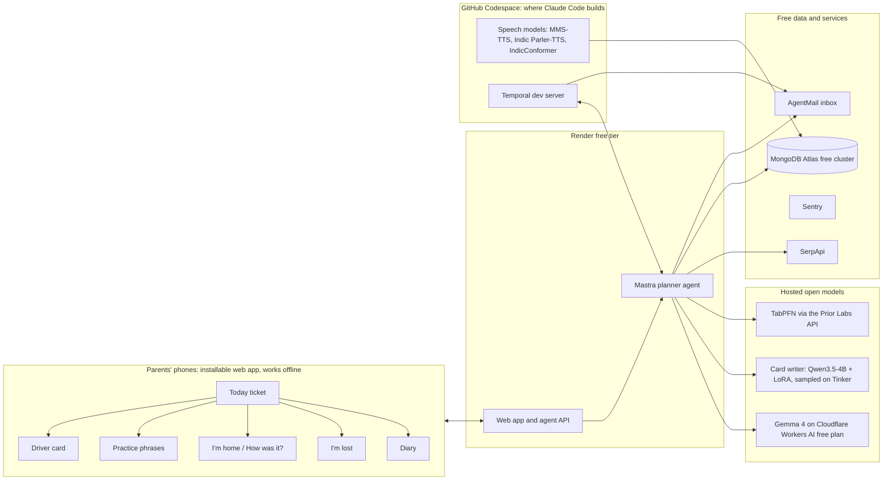

# Roundtrip — product and build plan

**Tagline:** Weekdays out, safely home.

**For:** Hacktoberfest 2026 DEV Challenge, Week 1

**One line:** An open-model planner that gets visiting parents out of the house each week, to real places with real people who speak their language, on outings they can manage on their own. It includes a private diary and a memory book.

**The thesis the whole post hangs on:** Most AI built for lonely parents tries to become their company. Roundtrip is an AI whose job is to make itself unnecessary. Every suggestion points to a real place or real people, and it never offers itself as company.

**Before you start:**
- Read the Week 1 theme as soon as it's posted, and make sure the story and title clearly connect to it.
- Create the repo only after Week 1 is live. Note any commits made after the deadline in the README.
- Check the exact submission deadline on the Week 1 challenge page.
- Check the name before you publish. A healthcare transportation company called Roundtrip already exists, so use a distinct repo and domain name such as roundtrip-family.
- Nothing runs on your laptop. Claude Code works inside a free GitHub Codespace, the models run on free hosted services, and the demo is hosted on Render's free tier. Tinker is the only service that uses credits.
- The build runs on its own in Claude Code's auto mode. The main demo household is a fictional persona (`data/persona/` and `docs/persona.md`), and every result that uses it is labeled synthetic. The playbook covers the one-time setup.

---

## 1. The story

This draft uses only what you've told me is true: your parents flew in for your graduation, they speak Telugu, and you were busy working. The demo household is a fictional persona, and the post says so. Add any other real details you're comfortable sharing, and never present invented lines as your parents' words.

> My parents flew to the US for our graduation. They speak Telugu, and for them it was a long trip to celebrate a big day.
>
> Then the ceremony was over, and we went straight back to busy workdays. On weekends we took them out. On weekdays, they were at home while we worked.
>
> Afterwards I kept thinking about those weekdays. What would it have taken for them to go out on their own: to find a place where people spoke their language, catch the right bus, say a few words in English, and come home safely, without waiting for us?
>
> Roundtrip is my answer. It plans a few outings each week, makes each trip something visiting parents can manage on their own, and then gets out of the way.
>
> To design and test it without turning my parents into a dataset, I wrote a detailed fictional household modeled on visits like theirs: Sarala and Venkat, a Telugu-speaking couple from Guntur staying with their child in Fremont, California. Their profiles, outings and words are invented, and every result that uses them is labeled synthetic. The planning, ranking, voice and safety features run for real.

### What the persona shaped in the design

These are design assumptions encoded in the fictional persona, not findings about real people. Details are in `docs/persona.md`, and the data is in `data/persona/`.

| Assumption | What Roundtrip does |
|---|---|
| No phone outside is the first barrier | Setup recommends a prepaid plan; the "I'm lost" and driver cards work fully offline |
| One guided ride would unlock the bus | **First ride together:** a new route is ridden once with the adult child on a weekend, then marked solo-ready |
| Missing the stop is a real fear | **When to press stop:** stop counts, the landmark just before their stop, and an offline GPS alert where possible |
| Familiar faces matter more than shared language | "Knows someone there" weighs heavily; neighbors and routines count as real options |
| A friend may speak another language | **Three words for a new friend:** short words in the friend's language, with Telugu-script pronunciation |
| Joining a group is its own barrier | **Help joining:** an English card saying what they want, plus who to ask |
| The two parents differ | **Per-parent profiles:** different reading support, times, walking limits and weather limits |

---

## 2. Why this matters

- **Living with adult children can increase isolation.** A McMaster Optimal Aging review notes that older immigrants who were independent at home can come to depend on family to communicate and get around, and that living with adult children can reduce their chances to interact with others.
- **Real stories show the same pattern.** AsAmNews profiled a grandfather who came to Philadelphia to help with his grandchildren and couldn't speak English or drive. A PolyU study of older Chinese migrants in Brisbane found that limited English and dependence on adult children for transport led to social isolation.
- **What helped was human connection.** A KGW story describes a son who connected his mother with people her age who spoke her language. Today that is done by nonprofit caseworkers, not software.
- **AI companions exist, and families feel uneasy about them.** Services like Hello Gloria and InTouch call seniors and remember their stories. Coverage of InTouch noted that some adult children feel guilty handing something so human to a machine. That unease is the gap Roundtrip is designed around.

---

## 3. Product definition

### Who it's for

- **The parents (primary users).** Often a couple, visiting for one to six months or newly moved. Limited English, usually not driving, and often with no US phone plan, so they rely on home Wi-Fi.
- **Language.** Your parents speak Telugu, so Telugu is the first language the product supports. Everything is built so other languages can be added.
- **The adult child (co-pilot).** Sets up the app, approves the weekly plan, and reads a short weekly summary and any diary entries the parents share.

### Any country

Roundtrip works wherever the adult child lives. Each household sets its **host country** and **local language**. Throughout this plan, "English" means the host country's local language; the main demo household is in the US, so there it is English.

What follows the household's country:
- The driver card, the practice phrases and the "I'm lost" card, all in the local language.
- The local emergency number, taken from an official source.
- Temperature units, date formats and currency.
- Search settings for SerpApi (country, language and location).

A second demo household, Telugu-speaking parents visiting their child in Germany, proves this works outside the US.

### The promise

Each week: two or three outings they would actually enjoy, that they can manage on their own, in their language.

### The rule the agent follows

Route to humans. Every suggestion must be a real place or real people. The assistant never presents itself as company, never pretends to be a person, and keeps its own replies short and practical.

### What it is not

- Not a companion chatbot.
- Not continuous location tracking.
- Not medical advice.
- No automated phone calls pretending to be a person.
- Not a diary that talks back, analyzes feelings, or reports them to anyone.

---

## 4. Scope

**Must have**
- A household profile for one or two parents: language, interests, mobility, home area.
- Event and place discovery with SerpApi.
- TabPFN ranking with a reason for each suggestion.
- An outing ticket in their language, and an English "Show the driver" card.
- Three phrases to practice for each outing, with audio.
- A web app on their phones that keeps working offline during outings.
- An "I'm home" check-in with a durable safety timer (Temporal).
- A "How was it?" voice reply.
- The adult child's weekly summary.
- A private diary for each parent: voice, text or photo entries in their own language, private by default, shared only when they choose.
- Language choice: each parent picks their language in setup. Voice uses free open models by default, with ElevenLabs as an optional upgrade where it supports the language.
- Any host country: the household sets its country and local language, and driver cards, phrases and emergency numbers follow it.
- A fallback ladder, so cities with no gatherings in the parents' language still get two or three good suggestions each week.
- Per-parent profiles: a parent who listens first gets audio-first tickets; a parent who reads English signs also sees the English words they'll meet. Each parent has their own times, walking limit and weather limits.
- First ride together: the first time a route appears, Roundtrip suggests riding it together on a weekend, then marks it solo-ready.
- When to press stop: each ticket counts the stops and names the landmark just before theirs, with an offline GPS alert where the phone can get a fix.
- Help joining: an English card for joining a group or volunteering, and who to ask.
- Three words for a new friend: for someone they've met who speaks another language, three short words in that language with Telugu-script pronunciation and audio.

**Should have**
- The Tinker-tuned card writer, compared against the base model.
- A memory of people they've met.
- Sentry traces.
- Evaluations running in GitHub Actions.
- The memory book: a printable keepsake of the diary entries, photos and outings the parents choose.
- Language onboarding: the same Tinker pipeline tunes the card writer for a newly added language.

**Out of scope for the first release**
- A native mobile app.
- WhatsApp integration.
- Matching parents across families.
- Your own cloned voice reading the cards (it needs a recording of your voice).
- Training a custom voice model for a specific dialect (section 8 explains how it would work).
- An always-on server for the safety timers in the hosted demo (section 7 explains why).

---

## 5. User journeys

### Setup (the adult child, about 10 minutes)

1. Create the household: choose the host country and its local language. Then, for each parent, add languages and dialect notes, interests (walking, cooking, gardening, library, places of worship, markets), dietary needs, mobility (maximum walk, comfort with transit, transfers), and preferred days and times.
2. Set the home area as the nearest bus stop or intersection, not the exact address. This keeps the address out of every external request.
3. Optionally import past outings, so the ranker starts with some history.
4. Add emergency contacts and the text for the English help card.
5. Install the app on each parent's phone home screen. It caches the week's content on home Wi-Fi.

### Sunday planning (the adult child, about 5 minutes)

The agent searches events and places for the coming week, filters them by language and accessibility, ranks them with TabPFN, and proposes four to six outings. Each comes with a short reason, for example: "Telugu-speaking group, one bus, morning, they loved a similar one."

You approve two or three, on the dashboard or by replying to the planning email from Roundtrip's inbox. Cards, directions, phrases and audio are generated and sent to their phones.

### Outing day (the parents)

1. The Today screen shows one ticket: the time, a photo of the place, the title in Telugu, and a large play button that reads it aloud.
2. Tapping the ticket opens step-by-step directions with landmark photos.
3. "Show the driver" fills the screen with the stop name in large English text.
4. "Practice" plays the three phrases they'll need.
5. All of this works with no connection, because it was cached at home on Wi-Fi.

### After the outing

1. Back home on Wi-Fi, they tap "I'm home."
2. The app asks "How was it?" They record 10 to 30 seconds and pick one of three faces.
3. The speech service transcribes the reply and summarizes it for you, including anyone they met.
4. The result is added to the ranking history, so next week's suggestions improve.

### Safety path

- **Timer.** Each outing starts a Temporal timer: expected return plus a buffer, 45 minutes by default.
- **Nudge, then alert.** If "I'm home" doesn't arrive in time, the app nudges them. If there's still nothing 20 minutes later, you get an alert email with the outing details.
- **Durability.** The timer keeps running through worker restarts. The demo proves this.
- **"I'm lost."** Always visible. It shows a large English card with their name, the home area and your phone number, and offers tap-to-call when a phone plan is available.
- **Phone plans.** Setup recommends a prepaid local SIM or eSIM for the visit. The app works without one, but calling for help needs one.
- **Weather.** Hard rules block outings in ice, heavy snow and heat advisories. Weather is also a ranking feature.

### Choosing a language (setup)

1. Each parent picks their language from a list. Your parents pick Telugu.
2. Setup shows what's ready for that language: reading and planning, the card writer, voice, and listening. For a language without a tuned card writer, the dashboard offers to run the tuning pipeline.
3. Cards, phrases and the diary all switch to that language. Bus, street and venue names stay in English.

### Diary (the parents)

1. From any screen, they tap Diary (నా డైరీ) in the bottom bar.
2. They hold the record button and talk in Telugu, or write, or add a photo. If they like, they tap a feeling word.
3. The entry is saved privately. If they're away from home Wi-Fi, it waits on the phone and syncs when they're back.
4. If they want you to see an entry, they tap Share. Otherwise it stays theirs alone.
5. Near the end of the visit, they choose entries, photos and outing tickets for the memory book: a printable keepsake in their own words.

---

## 6. UI

### Design direction

The memorable element is the outing ticket: one bold, rounded card holding everything needed for that trip, with its travel lines across the top and a stub that tears off when they're home. Everything around it stays quiet.

**Colors and type** follow `docs/brand.md`, which wins on any conflict. In short:
- **Colors:** ink `#1F2A44`, sky `#3E9BE0`, rail `#3B3F99`, sea `#13A09A`, bus and home `#F2A900` on paper `#FBFCFE`, with darker accessible variants for text and lines. Signal red is for "I'm lost" only, and home green for "I'm home" only.
- **Travel lines:** each way of traveling has its own precise, map-style line: a fine dotted arc for sky, a line with subtle ties for rail, a gentle wave for sea, a line with stops for the bus, and a fine dotted line for walking.
- **Art direction:** a realistic, premium travel product, never cartoonish. See `docs/brand.md`.
- **Typefaces:** Hind for all Latin text and Hind Guntur for Telugu, at a line height of about 1.6 for Telugu.

**Sizes**
- Parents' app: 22 px body text, 32 px ticket titles, 64 px on the driver card.
- Dashboard: 16 to 17 px.

**Layout**
- Parents' app: one task per screen, left-aligned, one main action per screen, plus a fixed bottom bar with I'm home, Diary and I'm lost.
- Dashboard: a dense planning board, with the week laid out in columns.

### Parents' app screens

```
TODAY                                   DRIVER CARD (full screen)
┌──────────────────────────────┐        ┌──────────────────────────────┐
│ Tuesday 10:30                │        │                              │
│ ┌──────────────────────────┐ │        │   Please tell me when we     │
│ │ [photo of the place]     │ │        │   reach:                     │
│ │ Title in Telugu          │ │        │                              │
│ │ Bus 12 · 25 min          │ │        │   MAIN ST & 5TH AVE          │
│ ├ ─ ─ ─ ─ ─ ─ ─ ─ ─ ─ ─ ─ ┤ │        │                              │
│ │ ▶ Listen    Directions   │ │        │   Thank you                  │
│ └──────────────────────────┘ │        │                              │
│                              │        │   ▶ Play in English          │
│ [ Show the driver ]          │        └──────────────────────────────┘
│                              │
│ [Home ✓] [Diary] [I'm lost]  │
└──────────────────────────────┘
```

The full set of screens:
- **Today:** one ticket.
- **Directions:** steps with landmark photos.
- **Driver card:** large English text.
- **Practice:** three English phrases, each with its pronunciation written in Telugu script underneath (for example, "Thank you" with థాంక్ యూ), plus a play button.
- **How was it?:** a large microphone button and three faces.
- **I'm lost:** the English help card.
- **Diary (నా డైరీ):** a large record button, a few feeling words to tap, and past entries, each clearly marked private or shared.

### Dashboard screens

- **Setup:** the household wizard, including each parent's language and what's ready for it.
- **This week:** suggestions with reason chips and scores, plus approve and swap buttons.
- **Their week:** what they went to, highlights from their replies, and people they met.
- **Shared with you:** diary entries your parents chose to share, and the memory book.
- **People and places:** what the app remembers.
- **Privacy:** the live "where data goes" table.
- **Safety:** timer buffers, contacts and weather rules.

### Accessibility and language rules

- Tap targets at least 56 px, with WCAG AA contrast.
- Text scales with the phone's settings.
- Telugu reads left to right, so no right-to-left layout is needed now. Keep the layout direction-aware so right-to-left languages can be added later.
- Every screen has a listen button, and nothing requires typing.
- Bus numbers, street names and venue names stay exactly as written in English, even inside translated text, so they match the signs.

### Button labels

- Use words the parents would say: "I'm home," "Show the driver," "Listen."
- Keep the same word through a flow: the "I'm home" button leads to "Home. Thank you."
- Errors give direction and never apologize, for example: "No internet. Your ticket still works."

---

## 7. Architecture

Nothing runs on your own computer. Every piece uses a free hosted service, except Tinker, which uses credits.



### Where each piece runs

| Piece | Where it runs | Cost |
|---|---|---|
| Building with Claude Code | A GitHub Codespace: a cloud computer in your browser | Free monthly quota |
| Planner, event understanding, judge | Gemma 4 26B A4B on Cloudflare Workers AI, with OpenRouter's free Gemma 4 models as a fallback | Free plans |
| Card writer | Qwen3.5-4B with the Tinker LoRA, sampled through Tinker. The adapter is also published on Hugging Face | Tinker credits |
| Ranking | TabPFN through the Prior Labs API | Free daily and monthly usage |
| Speech (generate, transcribe, evaluate) | Open models inside the Codespace. Results are saved, and the hosted demo plays them | Free |
| Database and vector search | MongoDB Atlas free cluster | Free |
| Safety timers | Temporal dev server inside the Codespace, saving state to a file | Free |
| Demo website and agent API | Render free tier | Free |
| Event search | SerpApi free plan | Free |
| Tracing | Sentry free plan | Free |
| Alerts, weekly summary, approve-by-reply | An AgentMail inbox | Free tier: 3 inboxes, 3,000 emails a month |
| Tests | GitHub Actions on a public repo | Free |

### Two modes

**Demo mode (what you build now).** Everything above, with the fictional demo family and synthetic data only. Render's free services sleep when idle, so the first visit can take a moment. Speech outputs and the durability demo are produced in the Codespace and saved; the hosted site plays the saved audio and shows the saved test results.

**Family mode (later, for real use).** The same open models move onto hardware the family controls: any machine with enough memory, or a rented server. Only the model endpoints in the config change. That portability is the point: free hosted endpoints were right for a demo with synthetic data, but they aren't right for a real family's diary.

### Where data goes

| Data | Goes to | Why |
|---|---|---|
| General queries ("events in their language near the home area"), no names or address | SerpApi | Live local events |
| Directions starting from the nearest bus stop | SerpApi Directions | Transit route |
| Planning prompts and event text | Cloudflare Workers AI or OpenRouter (Gemma) | Planning and event understanding |
| Card requests | Tinker | Writing cards |
| Outing history with no names | Prior Labs API (TabPFN) | Ranking |
| Card and phrase text, with names removed | ElevenLabs, only if you add a key | Optional voice upgrade |
| Error traces with personal data scrubbed | Sentry | Debugging |
| Planning emails, safety alerts and the weekly summary (first names and outing details only) | AgentMail | Emailing the adult child |

In demo mode, all of it is synthetic. Two warnings for real use:
- Free tiers come with their own data terms. Google's free Gemini API tier, for example, allows submitted content to be used to improve its products. Check the current terms of each Gemma host you use.
- Prior Labs asks users not to upload personal or sensitive data.

That's why family mode moves the open models onto hardware the family controls. Diary entries are encrypted before storage in every mode.

### Data model (MongoDB)

| Collection | What it holds |
|---|---|
| `households` | Host country, local language, local emergency number, home area, emergency contacts, safety settings |
| `parents` | Languages, dialect notes, interests, mobility, preferred times |
| `places` | Name, type, address, location, language tags, landmark photo |
| `events` | Source, title, time, venue, language match, cost, indoor or outdoor, raw result |
| `outings` | Event or place, which parents, planned time, status, enjoyment 1–5, people met, weather |
| `people` | First name, where they met, language, notes the parents chose to share |
| `cards` | Text in their language, English driver text, phrases, audio files, route steps |
| `diary_entries` | Parent, time, voice, text or photo (encrypted), transcript, feeling words, linked outing, private or shared, in the memory book or not |
| `languages` | Language code, text model status, which providers handle speaking and listening, tuned card-writer ID |

A vector index over event and place descriptions powers "more like the ones they enjoyed." The embeddings come from a small open multilingual embedding model, computed in the Codespace and stored with each record.

### Stack

- **Web app:** Next.js (App Router) with Tailwind, plus a service worker for offline use, deployed to Render.
- **Agent:** Mastra, in TypeScript, calling Gemma through an OpenAI-compatible provider pointed at Cloudflare Workers AI.
- **Workflows:** Temporal's TypeScript SDK.
- **Ranker:** a small Python service using `tabpfn-client`.
- **Card writer:** Tinker's sampling API, with the LoRA adapter also published on Hugging Face.
- **Speech:** Meta's MMS-TTS and AI4Bharat's Indic Parler-TTS for speaking, and AI4Bharat's IndicConformer for listening, all run in the Codespace.
- **Services:** Sentry's JavaScript SDK, the SerpApi JavaScript client and, optionally, the ElevenLabs API.
- **Email:** AgentMail's SDK, for alerts, weekly summaries and approve-by-reply.

---

## 8. The AI pieces in detail

### Gemma 4: the planner

Use Gemma 4 26B A4B (`@cf/google/gemma-4-26b-a4b-it`) on Cloudflare Workers AI, through its OpenAI-compatible endpoint.
- **Free allowance:** 10,000 neurons a day with no credit card. At Cloudflare's published price for this model, that's roughly 1 million input tokens or about 360,000 output tokens a day by my estimate. That's plenty for this build if responses are cached.
- **Fallback:** if the daily allowance runs out, the helper switches to OpenRouter's free Gemma 4 models (`google/gemma-4-31b-it:free`, then `google/gemma-4-26b-a4b-it:free`).
- **Optional third host:** if your Google AI Studio key works on the free tier, Gemma through the Gemini API can be added.
- **Reliability:** every call needs retries with backoff and a response cache.

Gemma has three jobs:
- **Planner.** It's the tool-calling model inside the Mastra agent.
- **Event understanding.** It turns raw search results into structured JSON: language match, whether the event suits older adults, indoor or outdoor, and cost.
- **Judge.** It scores the Tinker card writer's output. Gemma is a different model family from the Qwen card writer, so it isn't grading its own work.

In the model check (Phase 3), test how well Gemma handles Telugu.

### Tinker: fine-tuning the card writer

**The task.** Turn a structured outing (event, venue, time, route steps, phrases needed) into a warm, respectful card of 60 words or fewer in Telugu. The tone follows the persona notes in `docs/persona.md`: coastal Andhra (Guntur) Telugu, warm like a neighbor's daughter, respectful మీరు but never stiff, అమ్మా for a mother and నాన్నగారు for a father, never formal like a bank officer. Bus, street and venue names stay in English. It also gives three phrases in the local language (English in the US, German in Germany), with their pronunciation in Telugu script.

**Base model.** `Qwen/Qwen3.5-4B` on Tinker. Gemma isn't on Tinker's current model list, so the system uses two open models: Gemma as the planner and the tuned Qwen as the writer. That split is itself a "swap models" story.

**Data.**
- About 400 synthetic outings.
- Drafts from a capable, cost-efficient teacher model on Tinker, following its prompt-distillation recipe.
- An automated quality gate filters the drafts: code checks plus Gemma as a judge of tone and register. Failing drafts are regenerated once, then dropped. No manual corrections are needed.
- 50 are held out for evaluation.
- Review by native speakers can be added later.

**Training.** A LoRA, 2 to 3 epochs. At roughly 400 examples × 400 tokens × 3 epochs, about 0.5 million training tokens, Tinker's published price for this model puts training well under a dollar. Teacher sampling adds a little more. Record the actual total for the post.

**Evaluation (base vs tuned).**
- Rubric pass rate: respectful tone, 60 words or fewer, facts only from the input.
- Names preserved exactly: bus numbers, stops and venues unchanged.
- Blind pairwise preference from Gemma as the judge, with the order of each pair swapped to cancel position bias.
- Response time per card.

**Serving and sharing.** Cards are generated through Tinker's sampling API and saved, so the demo replays them without new calls. Export the LoRA as a PEFT adapter and publish it on Hugging Face, so anyone can run the tuned writer on their own hardware.

**Fallback.** If the 4B model is weak in Telugu, move up to `Qwen/Qwen3.5-9B`.

**If you have no Tinker credits.** The card writer runs on Gemma with the card-style prompt, the Tinker category is dropped, and everything else still works.

### TabPFN: learning what they enjoy

Each past or candidate outing is one row. Prior Labs' docs say raw tables with text categories and missing values work without manual encoding. Run it through `tabpfn-client`, Prior Labs' hosted API, which has free daily and monthly usage pools. Prior Labs asks users not to upload personal data, and the outing history has no names.

**Features:**
- category and language match (0, 1 or 2)
- travel minutes, transfers and walking minutes
- start hour and day of the week
- temperature and chance of rain
- indoor or outdoor, estimated group size and cost
- whether they know someone there and whether food is available
- days since their last outing

**Targets:** whether they went (a classifier) and enjoyment from 1 to 5 (a regressor).

**Ranking.** Each candidate's score is the probability they'll go times their expected enjoyment. The top contributing features become the reason chips on the dashboard.

**Evaluation.** Leave-one-out on the persona's 24 fictional outings in `data/persona/outings.csv`, including two it wanted but didn't go to. Label the results synthetic:
- Hold out each outing in turn and check whether it lands in the top 3.
- Compare against sorting by distance alone and against random order.
- In the persona data, every 5-star outing happened with the adult child, so report results with and without the `with_adult_child` feature, and say what that means for planning solo outings.
- With this little data, the post should be honest that the numbers are rough.

### SerpApi: finding what's on this week

- **`google_events`** for Telugu events near the home area, such as Telugu association gatherings, festival celebrations (Dasara, Bathukamma, Diwali, Sankranti, Ugadi) and Telugu film screenings, plus senior-center, library and community events. It has date filters for this week and next week.
- **`google_maps`** for regular places: temples and other places of worship, community centers, libraries with English conversation circles, Indian grocery stores, parks with walking groups.
- **`google_maps_directions`** for transit routes from the nearest bus stop.

Cache results in MongoDB and stay within the free plan's monthly search limit.

**Any country.** Every search passes the household's country, language and location. Google's transit data doesn't cover every city. When directions aren't available, the ticket gives walking directions or plain step-by-step instructions, and the ranker favors places within walking distance.

**When there are no gatherings in their language: the fallback ladder.** The planner works down these levels until it has two or three good suggestions:
1. **Same language:** Telugu associations, festivals, film screenings.
2. **Shared culture:** Indian or South Asian groups, temples, Diwali or Navratri events, Hindi-speaking gatherings, Indian grocery stores.
3. **Places where language barely matters:** parks, walking trails, gardens, farmers markets, museums on free days, libraries with books in Indian languages.
4. **Programs for newcomers and older adults:** senior centers, library conversation circles, yoga, gardening or craft classes, volunteering.
5. **A regular routine:** the same park or market at the same time each week, so faces become familiar.

Each suggestion's reason says which level it came from, for example: "No Telugu events nearby this week. This walking group meets daily, and no English is needed." 

### Speech: their language, out loud

All speech models run inside the Codespace. Results are saved so the hosted demo plays them without any speech server.

- **Speaking (default, free):** Meta's MMS-TTS Telugu checkpoint or AI4Bharat's Indic Parler-TTS, whichever wins the model check.
- **Listening:** AI4Bharat's IndicConformer, an MIT-licensed open model built for India's 22 official languages, including Telugu.
- **Measuring quality without a person:** generate Telugu speech from known text, transcribe it back, and measure the character error rate.
- **ElevenLabs (optional):** if you add a free-plan key, Eleven v3, which lists Telugu among its 74 supported languages, can voice a few demo clips for comparison.

### Language router: any language, with or without ElevenLabs

Each parent picks their own language in setup. A router then decides which model handles each job for that language:

| Job | Default | Upgrade or fallback |
|---|---|---|
| Reading and planning | Gemma 4 on Cloudflare Workers AI (published guides describe 140+ languages) | Gemma 4 31B through OpenRouter, plus a "needs tuning" flag |
| Writing cards | The Tinker-tuned card writer for that language | Gemma until the tuning pipeline has run for that language |
| Speaking | Free open models: AI4Bharat's Indic Parler-TTS for Indian languages, Meta's MMS-TTS for 1,100+ languages | ElevenLabs Eleven v3 (74 languages, including Telugu) for higher-quality demo audio, when a key is available |
| Listening | AI4Bharat's IndicConformer for Indian languages | Meta's MMS speech recognition (1,107 languages) |

**About the fine-tuning idea.** You can't fine-tune a model and send it to ElevenLabs:
- ElevenLabs serves only the languages on its supported list and rejects requests in others.
- It doesn't accept models trained elsewhere.
- Its voice cloning creates a new voice within the languages it already supports; it doesn't add a language.

So when a family's language isn't covered, the fine-tuning happens on the open side, and the family can run the result wherever they choose. That's one of the strongest answers to the challenge's "why open" question.

**Onboarding a new language (built now, for the card writer).** The Tinker dataset and training scripts take the language as a parameter, so the same pipeline can tune the card writer for any language a family adds.

**Training a custom voice (described, not built in the first release).** If neither ElevenLabs nor the open models handle a family's language or dialect well, a willing family member records a set of sentences, and an open speech model such as an MMS-TTS or Indic Parler-TTS checkpoint is fine-tuned on those recordings.

**Licenses.** Meta's MMS models are released for non-commercial use. That's fine for this family project, but check it before any commercial use.

**Demo.** Switch the demo household to a language that's on the open models' list but not on ElevenLabs' list, and show a card still being read aloud.

### Diary and memory book

**What it is.** Each parent's private space for feelings and experiences: voice notes, short writing or photos, in their own language. It's somewhere to keep what the days felt like, for themselves, and to look back on later.

**How it works.**
- They record in Telugu, and the speech service transcribes the entry.
- Each entry is encrypted before it's stored, along with the original audio, the date, and the outing it relates to if they choose.
- Feeling words are ones they tap themselves, using everyday words from the persona notes: బాగుంది, సంతోషం, ఊరు గుర్తొచ్చింది, అలిసిపోయా, బోరు, ఒంటరిగా ఉంది, టెన్షన్ and కంగారు. The app doesn't detect or score emotions.

**Privacy and consent.**
- Every entry is private by default. They can share an entry with you, unshare it, or delete it at any time.
- The app doesn't analyze, summarize or score entries unless they ask, for example "read me last week's entries" or "make my memory book."
- A setting to use the diary when planning outings exists, and it's off by default.
- In the hosted demo, the diary holds only synthetic entries. Real diaries belong in family mode, on hardware the family controls.

**The memory book.** Near the end of a visit, they choose entries, photos and outing tickets. Roundtrip arranges them into a printable book in their language, using their words exactly. Gemma suggests chapter titles only when asked. This is the "for future use" part: something to take home, and to share with grandchildren later if they want.

**How it fits the core rule.** The diary doesn't talk back or try to be company. It's their space, with a button on the same screen that calls you.

### Mastra: the planner agent

Mastra decides; Temporal remembers and waits.

The agent runs on Gemma through an OpenAI-compatible provider pointed at Cloudflare Workers AI. Its tools:
- `searchEvents` and `searchPlaces` (SerpApi)
- `getDirections` (SerpApi)
- `rankOutings` (TabPFN)
- `writeCard` (the tuned card writer on Tinker)
- `speak` (the voice router)
- `remember` and `recall` (MongoDB)

The route-to-humans rule lives in the system prompt and is enforced by a test.

### Temporal: weekly plan and safety timers

- **`weekPlan`** runs every Sunday at 6 pm. It plans the week, then waits for your approval. For each outing it sends a reminder the day before and starts `outingSafety` at departure. Afterwards it asks "How was it?" and records the result, and on Sunday it sends the summary.
- **`outingSafety(outingId, expectedReturn)`** waits for the "home" signal until the expected return time plus the buffer. If nothing arrives, it nudges the parents, waits 20 more minutes, then alerts you.
- **Email.** Alerts and the weekly summary go out by email from Roundtrip's AgentMail inbox. Replying "approve" to the planning email sends the approval signal to `weekPlan`.
- **Where it runs.** The Temporal dev server runs in the Codespace and saves its state to a file. No free host keeps a Temporal server running all the time, so the hosted demo shows the recorded durability test rather than live timers. In family mode, Temporal runs on the family's own machine or server.
- **The demo moment:** kill the worker while it's waiting, restart it, and show the alert still fires on time.

### Supporting tools

- **MongoDB Atlas:** the free cluster is the data layer, with vector search for "more like the ones they enjoyed." Confirm vector search works on the free tier in Phase 2; if it doesn't, compute similarity in code over the stored embeddings.
- **Sentry:** a trace for every agent run and tool call, showing latency, tokens and errors. Show one slow step you found and how you fixed it.
- **GitHub Actions** (the GitHub Copilot category): run the evaluations on every push.
- **DEV Agent Sessions:** upload your Claude Code sessions and embed them in the post. The prompt playbook covers this.

---

## 9. Prize categories and what judges need to see

You can win only once per challenge. Build the post around four deep uses: Tinker, TabPFN, SerpApi and Temporal. Every category below works on a free tier, except Tinker, which uses credits.

| Category | What you build | Proof in the post |
|---|---|---|
| Gemma ($200) | Planner, event understanding and judge, served free on Cloudflare Workers AI with an OpenRouter fallback | Example plans, fallback handling, latency per call |
| Tinker ($200) | Card writer LoRA on Qwen3.5-4B, published on Hugging Face; the same pipeline onboards new languages | Base vs tuned table, actual cost, blind judge preference |
| TabPFN ($200) | Ranker on the demo family's outing history, via the Prior Labs API | Leave-one-out top-3 vs the distance baseline; a reason chip |
| Render ($200) | Hosts the demo web app and agent API on the free tier | Live link |
| SerpApi ($100) | Live events, places and transit directions | Example queries; cache hit rate |
| Mastra ($100) | Agent over open models with tools and memory | Agent and tools diagram |
| MongoDB Atlas ($100) | Free cluster as the data layer, with vector search | Schema and a vector query |
| Temporal ($100) | Durable weekly plan and safety timers | The kill-the-worker demo |
| Sentry ($100) | Agent tracing on the free plan | Trace screenshots and the debugging story |
| GitHub Copilot ($100) | Evaluations in GitHub Actions; built in a GitHub Codespace | Screenshot of an Actions run |
| ElevenLabs ($100) | Optional: a few Telugu demo clips on the free plan, compared with the open voices | Embedded audio clips |

---

## 10. Why open innovation matters: answering every question

The challenge asks five questions. Answer each directly in the post, with a number or a screenshot.

**1. Does it run on a laptop with no internet?**
Be honest about where the line is.
- **The parents' phones:** they work fully offline during outings, because cards, directions, phrases and audio are cached at home. Prove it with an airplane-mode clip.
- **The models:** they don't run on your laptop, because you don't have the memory or storage. But every model is open-weight, so nothing ties the build to a provider. Gemma, the tuned Qwen writer and the speech models can move onto any machine a family controls by changing a config line.

**2. Does it keep someone's data off a server they don't control?**
- **In the demo:** everything is synthetic, which is the only responsible way to use free hosted endpoints.
- **For real use:** free hosted tiers come with their own terms. Google's free Gemini tier, for example, allows submitted content to be used to improve its products, and Prior Labs asks users not to upload personal data. That's why a real family's diary and routine belong in family mode, on the same open models running on hardware they control.
- **The closed alternative:** a closed API doesn't give you that option at all.

**3. Can you fine-tune, swap models, or change how the agent behaves?**
All three.
- **Fine-tune:** you tuned a 4B model for Telugu and its respectful tone, and published the adapter so anyone can run it.
- **Swap:** the planner runs on Gemma, the writer on a tuned Qwen, and speech on MMS or Indic Parler-TTS. The language router chooses per language.
- **Change behavior:** the agent follows a rule you control and test, which is to route to humans and never act as company.

Add the longevity point. Tinker's own model page lists models it retired in June and July 2026. A hosted model can disappear; the weights you exported can't be taken away.

**4. Does it cost nothing to run?**
Nearly. Tinker is the only paid service, covered by its Hacktoberfest credits and capped. Everything else runs on free tiers. Report the real totals from docs/costs.md.

**5. Where did the open approach work better than a closed one?**
Use your own results:
- the judge preference and rubric pass rate for tuned vs base cards
- language reach: ElevenLabs serves only the languages on its list and doesn't accept outside models, while open models let a family add their own language
- open Telugu speech models from AI4Bharat and Meta, measured with your speech round-trip test
- portability: the same models can move from free hosted endpoints to a family's own hardware without a rewrite

---

## 11. Evaluation plan

| What | Metric | Target or comparison |
|---|---|---|
| Ranker | Leave-one-out top-3 hit rate on the persona's 24 outings (synthetic), with and without the with-adult-child feature | Beats distance-only and random |
| Event understanding | Field accuracy on 40 synthetic listings with known labels | At least 85% on language match |
| Speech | Character error rate on synthetic Telugu audio (text to speech to text) | Report for each speech model |
| Card writer | Rubric pass rate and exact-name preservation | Tuned beats base on 50 held-out outings |
| Card writer | Blind pairwise preference from Gemma as judge, with order swapped | Report it, whatever it is |
| Agent | Share of suggestions that are real places or real people | 100% |
| Agent | Time to produce a week's plan; searches per plan; Gemma retries and fallbacks per plan | Report |
| Offline | Today, directions, driver card, practice and "I'm lost" work in airplane mode | Pass |
| Durability | The safety alert fires on time after the worker is killed mid-wait | Pass |
| Diary privacy | Entries encrypted at rest; private entries never reach the dashboard | Pass |
| Language router | A language ElevenLabs doesn't list still produces audio through an open model | Pass |
| Email | An "approve" reply reaches weekPlan, and a missed check-in sends an alert email | Pass |
| Fallback ladder | In a demo area with no Telugu events, every week still gets 2 or 3 suggestions, each saying which level it came from | Pass |
| Any country | The Germany demo household gets German phrases, a German driver card and the right emergency number | Pass |
| Speed | Response time per call for Gemma, the card writer and TabPFN | Report |

---

## 12. Safety, privacy and consent

- **Consent.** Real use starts only after the parents agree to what the app does and stores. Voice replies are optional, and they can delete anything.
- **No continuous tracking.** Safety comes from expected return times and check-ins.
- **Honest about what it is.** It never claims to be a person, and its replies stay short.
- **Not medical.** If a reply mentions feeling unwell, the app passes that to you and doesn't give advice.
- **Outing safety.** Daylight by default, weather rules, limits on transfers and walking, and the English help card always one tap away.
- **Scam awareness.** The first card includes a short tip: never share bank details or pay strangers.
- **Diary privacy.** Entries are private by default and encrypted at rest. The app never analyzes or scores them unless the parent asks, and never passes their feelings to you unless they share an entry.
- **A person to talk to.** The diary screen has a button that calls you.
- **A fictional persona, clearly labeled.** The main demo household, Sarala and Venkat, is invented and modeled on visits like your parents'. It lives in `data/persona/` and is committed openly. Never present its lines as quotes from real people.
- **Real family data, if you collect it later,** goes only in `data/family/`, with your parents' consent, and never to free hosted services.

---

## 13. Build order

There's no calendar. Claude Code runs in auto mode inside a GitHub Codespace, works through the phases in order, and starts the next one as soon as the current one's checks pass. Every step that would normally need a person uses a synthetic substitute.

### One-time setup (the only things you do)

1. After Week 1 is live, create the GitHub repo and open a Codespace on it. A 4-core machine with 16 GB of memory gives about 30 free hours a month; a 2-core machine gives about 60.
2. Add docs/plan.md, plus CLAUDE.md and .claude/settings.json from the playbook.
3. Create the free accounts yourself, then add the keys as Codespaces secrets. Sign-ups use CAPTCHAs and verification, and the keys should be in your name. After that, Claude Code creates everything inside those accounts through their official APIs.
4. Install Claude Code in the Codespace terminal and start it in auto mode.
5. Paste each phase's prompt, or the run-everything prompt once.
6. At the end, publish the post, upload the sessions, and delete the Codespace so it stops using your storage quota.

| Stage | What gets built | Playbook phases | How it checks itself |
|---|---|---|---|
| Foundations | Build plan, repo, data layer and demo family, model check, SerpApi tools | 0–4 | Tests pass. The model check scores Telugu with back-translation, a judge model and speech round-trips |
| Core product | Event understanding, TabPFN ranker, Mastra agent, parents' app with offline support, dashboard | 5–9 | Accuracy against synthetic ground truth, leave-one-out, the route-to-humans test, the offline Playwright test, screenshot self-review |
| Fine-tuning | Card style, dataset, Tinker training, evaluation, publishing the adapter | 10a–10d | Automated quality gate, a spending cap, judge pairwise evaluation |
| Voice, diary and workflows | Voice router, diary and memory book, Temporal workflows | 11a, 11b, 12 | Routing tests, diary privacy tests, the kill-the-worker durability test |
| Ship | Render deploy, Sentry, GitHub Actions, privacy audit, accessibility | 13–17 | A live URL, privacy fixes, accessibility screenshots |
| Write-up | Numbers, README, draft post | 18 | Every number traced to the command that produced it |

Some steps move at a service's pace rather than the agent's: Tinker training, Render builds, and the free Gemma hosts' daily limits.

Claude Code keeps docs/progress.md as it goes. It's your best raw material for the write-up, which is judged most heavily.

---

## 14. Repo structure

```
roundtrip-family/
  CLAUDE.md            Project rules for Claude Code
  .devcontainer/       Codespace setup
  apps/web/            Next.js: /parents (installable, offline) and /plan (dashboard)
  agent/               Mastra agent, tools, voice router and email notifications
  workflows/           Temporal workflows and worker
  ranker/              TabPFN service (tabpfn-client), leave-one-out evaluation
  speech/              Speech generation, transcription and evaluation scripts
  finetune/            Tinker dataset, training, evaluation, adapter export
  evals/               Route-to-humans, offline, durability, diary privacy, event understanding
  data/demo/           Fictional demo family, saved model outputs and audio (committed)
  docs/                Plan, decisions, progress, costs, numbers, screenshots, post draft
  .github/workflows/   Evaluations on every push
  README.md            Setup, models, any post-deadline commits
```

---

## 15. The write-up

### Title options (adjust to the Week 1 theme)

- My parents flew in for our graduation. Then I went back to work. So I built them a round trip: out the door on their own, safely home by evening.
- I built an AI whose job is to make itself unnecessary, for my parents.
- Roundtrip: open models that help visiting parents build their own week.

### Outline, following the DEV template

1. **What I Built.** The story from section 1, trimmed to its strongest four paragraphs. Then three sentences on the product and a GIF of the ticket.
2. **Demo.** A 90 to 120 second video, plus the Render link.
3. **Code.** Embed the repo.
4. **How I Built It.** The architecture diagram (DEV renders Mermaid), then one paragraph and one number for each piece. Mention that it was built entirely in a free Codespace. Embed agent session slices where they fit.
5. **Why Does Open Innovation Matter?** The five answers from section 10, each with proof.
6. **About the demo household.** Say clearly that Sarala and Venkat are a fictional persona modeled on visits like your parents', and why: to design carefully without turning your parents into a dataset. If you later show Roundtrip to your parents, add their real reactions here, in their own words.
7. **What didn't work.** Thin event results, model gaps in Telugu, free-tier errors, the small dataset. Say plainly that the households, outings, evaluations and diary entries are synthetic, and which results come from live searches.
8. **My Agent Session.** The full curated session.
9. **Prize Categories.** Only the genuine ones.

### Demo video shot list

1. A graduation photo, if you're happy to share one, and one sentence of story (5 seconds).
2. Sunday planning: suggestions with reason chips (15 seconds).
3. A phone in airplane mode: the ticket, listening in Telugu, the "press stop after the big Safeway" step, the driver card (25 seconds).
4. The practice phrases (10 seconds).
5. A "How was it?" reply turning into your summary (15 seconds).
6. Killing the Temporal worker in the Codespace, and the alert email still arriving (15 seconds).
7. The base and tuned cards side by side (10 seconds).
8. A synthetic diary entry kept private, then another shared (10 seconds).
9. Switching the household to a language ElevenLabs doesn't support, with the card still read aloud by an open model (10 seconds).
10. Switching to the Germany household: the driver card and phrases change to German (10 seconds).

---

## 16. Risks and what to cut

| Risk | What to do |
|---|---|
| Free Gemma hosts run out or return errors | Retries with backoff, a response cache, a fallback from Cloudflare to OpenRouter, and saved outputs for the demo |
| Codespace quota runs out | Use a 2-core machine for routine work, stop the Codespace when idle, and delete it when done. Without a payment method, GitHub blocks use instead of billing |
| Few or no events in their language nearby | The fallback ladder in section 8 always produces suggestions, and says honestly when there's nothing in their language |
| Thin transit data in some countries | Walking directions or plain step-by-step instructions, and a preference for places within walking distance |
| Weak model quality in Telugu | Test in the model check, then try the other Gemma size or Qwen3.5-9B for the card writer |
| The persona may not match real parents | Say so plainly, treat its patterns as design assumptions, and invite real feedback |
| A phase gets stuck | Cut in this order: ElevenLabs audio, the people memory, Sentry, the memory book |
| Credits or cost | Only Tinker spends money, within a cap. Everything else stays on free tiers |
| Open speech models vary in quality and license (Meta's MMS models are non-commercial) | Measure before relying on one; check licenses before any commercial use |

---

## Sources

- Challenge rules, judging and prizes: dev.to/challenges/hacktoberfest-weekend-2026-10-01 and dev.to/challenges/hf26
- Isolation among immigrant seniors: mcmasteroptimalaging.org/blog/detail/blog/2023/10/18/social-isolation-and-loneliness-among-immigrant-and-refugee-seniors
- AsAmNews, Chinese elderly migrants: asamnews.com/2024/08/27/lonliness-mental-health-immigration-chinese-elders
- KGW, caregiving for immigrant elders: kgw.com/article/news/community/caregiving-immigrant-elders-united-states/281-64420b65-1ebc-4021-9efe-7ae49afba495
- PolyU study, older Chinese migrants in Brisbane: research.polyu.edu.hk/en/publications/veiled-entrapment-a-study-of-social-isolation-of-older-chinese-mi/
- InTouch coverage, including families' guilt: silvereco.org/en/intouch-an-ai-that-calls-your-parents-for-you/
- Hello Gloria: hello-gloria.com
- Gemma 4 on Cloudflare Workers AI: developers.cloudflare.com/workers-ai/models/gemma-4-26b-a4b-it/
- Workers AI free allocation and pricing: developers.cloudflare.com/workers-ai/platform/pricing/
- Free Gemma 4 models on OpenRouter: github.com/cheahjs/free-llm-api-resources
- GitHub Codespaces free quota: docs.github.com/en/billing/concepts/product-billing/github-codespaces
- TabPFN API and metering: docs.priorlabs.ai/api-reference/metering
- Tinker models, pricing and retirements: tinker-docs.thinkingmachines.ai/tinker/models/models_and_pricing/
- SerpApi Google Events API: serpapi.com/google-events-api
- ElevenLabs supported languages: elevenlabs.io/docs/help-center/other/what-languages-do-you-support
- AI4Bharat IndicConformer: huggingface.co/ai4bharat/indic-conformer-600m-multilingual
- Meta MMS (speech recognition and text-to-speech for 1,100+ languages): huggingface.co/docs/transformers/model_doc/mms
- AgentMail docs and free tier: docs.agentmail.to/agent-onboarding
