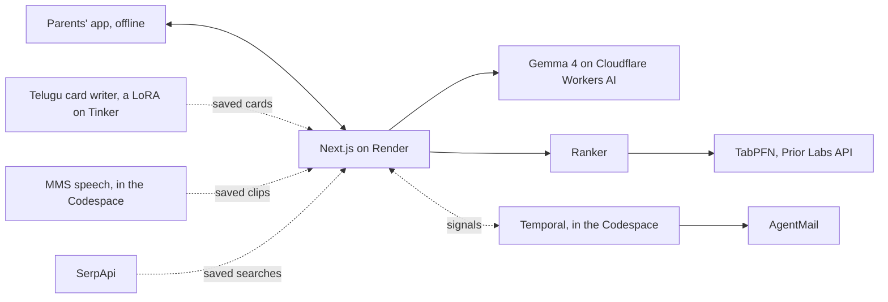

*This is a submission for the Hacktoberfest 2026 DEV Challenge, Week 1.*

## What I Built

My parents flew to the US for our graduation. They speak Telugu, and for them it was a long trip to celebrate a big day.

Then the ceremony was over, and we went straight back to busy workdays. On weekends we took them out. On weekdays, they were at home while we worked.

Afterwards I kept thinking about those weekdays. What would it have taken for them to go out on their own: to find a place where people spoke their language, catch the right bus, say a few words in English, and come home safely, without waiting for us?

Roundtrip is my answer. It plans a few outings each week, makes each trip something visiting parents can manage on their own, and then gets out of the way.

Roundtrip has two halves. The parents get an installable app that works offline on an outing: the day's ticket in Telugu, read aloud, directions that say when to press stop, a card to show the driver, a few phrases to practise with Telugu-script pronunciation, "I'm lost", a private diary and a memory book. Their grown child gets a dashboard to approve the week, see why each outing was picked, and get an email if a parent isn't home on time.

Most AI built for lonely parents tries to become their company. Roundtrip's job is to make itself unnecessary: every suggestion is a real place or real people, and it never offers itself as company. A test in CI enforces that rule.

## Demo

Live: https://roundtrip-web.onrender.com (a free Render instance, so the first visit after a quiet spell takes about half a minute to wake). Open the parents' app as Sarala, then the dashboard for Fremont or Munich.

## Code



## How I Built It

Everything was built in a free GitHub Codespace, by Claude Code working on its own from a written plan.

- **Gemma 4 plans, reads and reviews.** A Mastra agent on Gemma 4 26B A4B, free on Cloudflare Workers AI, picks the week and explains each choice in a line. Planning a week takes a median 4.7 s per call; of 1,138 live answers, one needed a retry and none needed the OpenRouter fallback. Reading 40 synthetic event listings, it got the language right on all 40 and the category on 85%.
- **TabPFN ranks.** For each parent, TabPFN predicts whether they'd go and how much they'd enjoy it, from what they rated before. Holding out each of the persona's 24 outings, it put 71% of the liked ones in its top 3 of 21, against 36% for travel time alone and 14% at random, and none of the disliked ones.
- **SerpApi finds real places.** 39 live searches in all: places, events, and transit directions that always start from the nearest stop, never the home address. Every answer is saved, so re-plans make no new searches.
- **Tinker tunes the Telugu card writer.** A LoRA on Qwen3.5-4B, trained once by prompt distillation from Qwen3.5-397B-A17B drafts that passed a Gemma gate. Training cost $0.22; the whole fine-tune, pilots and judges included, $2.04. On 40 held-out outings it passed every code check on 98% of cards, against 72% for the untuned model and 85% for Gemma. The adapter is public on Hugging Face.
- **Open voices read everything aloud.** Meta MMS voices every card, phrase and help card on the family's own hardware: 44 clips, scored by transcribing them back (character error rate 0.14 on Telugu card bodies, 0.017 on English phrases).
- **Temporal keeps the safety timer honest.** If "I'm home" doesn't arrive by the expected return plus a buffer, the phone gets a nudge, then the adult child gets an email with the official emergency numbers. I killed the worker 26 seconds before an alert was due; the restarted worker sent it 160 ms late, once.
- **Render, MongoDB Atlas, Sentry and AgentMail** host the demo, hold sessions and the encrypted diary, trace each planner run, model call and tool call (names and counts, never prompts), and carry the emails.
- **GitHub Actions** runs 224 unit tests and evals, the Python tests, the privacy check and the offline and accessibility tests on every push, without calling a paid API.

## Why Does Open Innovation Matter?

**Does it run on a laptop with no internet?** The parents' phones do: tickets, directions, phrases and audio are cached at home, and the app works with the network off. The models don't run on my laptop, but every one is open-weight, so Gemma, the tuned Qwen writer and the speech models can move to a machine a family controls without a rewrite.

**Does it keep someone's data off a server they don't control?** In this demo everything sent to a hosted model is synthetic, and CI fails if code calls a host that isn't in the registry. Free hosted tiers have their own terms, and Prior Labs asks users not to upload personal data, so a real family's diary and routine belong on their own hardware, on the same open models.

**Can you fine-tune, swap models, or change how the agent behaves?** All three. I tuned a 4B model for Telugu's respectful register for $2.04 and published it; the planner runs on Gemma, the writer on Qwen and speech on MMS, chosen per language; and the agent follows a rule I wrote and test.

**Does it cost nothing to run?** Nearly. Tinker spent $2.04; everything else ran on free tiers.

**Where did open work better than closed?** The tuned 4B writer passed more of the card checks than a general model. Open speech models let a family add a language a commercial voice doesn't list. And weights you exported can't be retired out from under you.

## About the demo household

Sarala and Venkat are a fictional persona modeled on visits like my parents', a Telugu-speaking couple from Guntur staying with their child in Fremont. I wrote them so I could design carefully without turning my parents into a dataset. Their profiles, outings, ratings and diary entries are invented, and every result that uses them is labeled synthetic. Kamala and Raghu in Munich, also fictional, show the same code serving another country, with German phrases and 112 from the official source.

## What didn't work

- Live search found no Telugu event in any of the three areas that week, so every real week fell back to the ladder's lower rungs: shared culture, then places where language barely matters.
- The tuned writer passed more code checks but didn't win on judged quality: Gemma preferred its own cards 20 to 8, and a third judge, Kimi-K2.6, called it 14 to 12. Reading this week's cards, I found two wrong words and two that left out the walk from the stop, so every card now passes a Gemma review first; the tuned writer wrote 7 of 10.
- The plan's Telugu voice and listener from AI4Bharat are gated, so Telugu uses Meta's MMS for now. MMS has no Mandarin voice at all.
- TabPFN is the slow step: a live re-plan took 73 s, mostly ranking on a free instance that sleeps. Ranking both parents at once and waking the ranker early brought it to 49 s.
- With 24 synthetic outings, one outing moves a leave-one-out rate by 5 to 10 points. The card and speech scores are automated, not a native speaker's review.

## Prize Categories

Gemma, Tinker, TabPFN, Render, SerpApi, Mastra, Temporal, Sentry. (MongoDB Atlas holds the data in development, but the hosted demo runs without it until Atlas allows Render's addresses, so I'm not entering it.)
